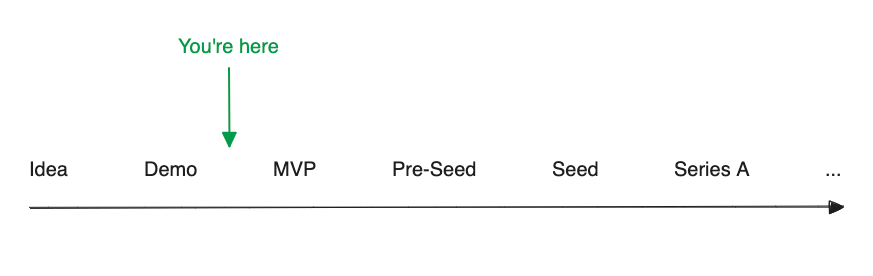

# After Le Wagon 🚙 - The Roadmap For Founders

== NB. This is an in-progress draft ==

Hi 👋 and thanks for dropping by

## Who you are 🙋

You're an aspiring tech founder who's just finished Le Wagon's 9-weeks of intensity and fun (congrats on becoming a Full Stack Developer!). Now you're wondering - what next?. Unlike career switches, the roadmap for starting a business is much less clear... so read on.

## The Entrepreneurship Roadmap 🛣️

## First things first 🥇

Le Wagon does a great job at teaching you **how to build products well**. You've built at least 2 impressive products from scratch during your course. But it's not an [Accelerator](https://en.wikipedia.org/wiki/Startup_accelerator) and it doesn't teach you **what products to build**.

The temptation is to dive straight into building your product after the bootcamp, especially as you've already developed something. Instead, you should answer the question 'am I building the right product?'.

## The right product 👩‍💻

**What problem are you solving?** Have you validated this is a problem? How have you done that?

Code is the most expensive way to validate a product. Remember that and repeat it often. Instead look for quick and dirty ways to validate that this is really 'something people want'.

Here are a few ways to validate you're building the right thing:
* [Assumptions Mapping](https://www.strategyzer.com/library/how-assumptions-mapping-can-focus-your-teams-on-running-experiments-that-matter)
* [Talking to users](https://www.ycombinator.com/library/Iq-how-to-talk-to-users)
* Developing a [Concierge MVP](https://codup.co/blog/what-is-concierge-mvp/) / [Wizard of Oz MVP](https://www.rabitse.com/blog/wizard-of-oz-mvp-or-concierge-mvp)

General principles:
* Get in front of a customer as fast as possible
* Get in front of as many customers as possible
* Only code what you need 'now'
* Take a [Design Thinking](https://en.wikipedia.org/wiki/Design_thinking) approach

## The right business 👔

A product is not a business. Now you need to design the business that goes with your product.

Follow these frameworks:
* [The Business Model Canvas](https://assets.strategyzer.com/assets/resources/the-business-model-canvas.pdf)
* [Business Plan Template](https://www.princes-trust.org.uk/how-we-can-help/tools-resources/business-tools/business-plans)

Basically, do this! Although this paragraph is short, this is a long process of discovery.

## Learning about startups 📈

You'll also need to learn about the business of startups:
* [YC Startup School](https://www.startupschool.org/) (listen as a [Spotify Playlist](https://open.spotify.com/playlist/7IUwR6O3h4zPLqLWBx10w8?si=8c25483af42e465e))
* [Antler Academy](https://www.antler.co/academy)
* [Le Wagon Founders Program](https://lewagon.notion.site/Founders-Program-b74a60a704e3489c9b1c18398500c10a#a82960ce51264eb28f2f2255e566e924)
* There are many other equivalent libraries...

## The next technical steps 🪜

Great, you've validated your product, outlined the business and learned about startups. Now you actually want to get building.

Read this 👉 (From Demo to MVP 🚀)[from_demo_to_mvp.md]

## Find collaborators 👯‍♀️

* Work with others, it's much more fun! You've just graduated with a load of other developers keen to improve their skills. Share your project and see if you can get others excited about it. Remember you're just working on a side project until you have users/customers.

## General advice 📣

If you're just looking for general advice after finishing Le Wagon:
* [after-le-wagon by Damien Le Thiec](https://github.com/damienlethiec/after-le-wagon) was a great inspiration for this
* [general advice](general_advice.md) gives advice on what and how to continue learning

## Further resources 📝

See here 👉 (From Demo to MVP 🚀)[from_demo_to_mvp.md]

## Contributing 👏

If you're a fellow alumni or TA of Le Wagon (or just interested!), then please do send a pull request to improve this doc.

## With thanks 😍

The following amazing Le Wagoners contributed enormously to this:
* [Milly Dyer](https://www.linkedin.com/in/millydyer/) (careers)
* [Marta Bas](https://www.linkedin.com/in/mbas/) (careers)
* [James Goforth](https://www.linkedin.com/in/james-goforth/) (product)
* [Jamie Reynolds](https://www.linkedin.com/in/jamie-s-a-reynolds) (product)
* [Martin Van Aken](https://www.linkedin.com/in/martinvanaken/) (dev/product)
